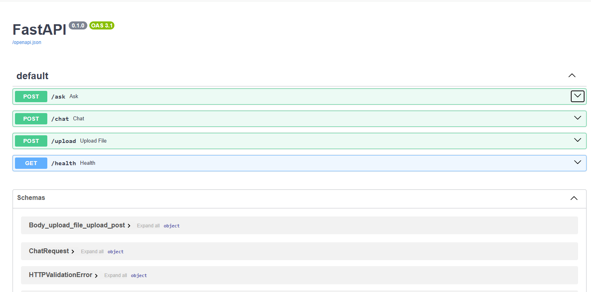
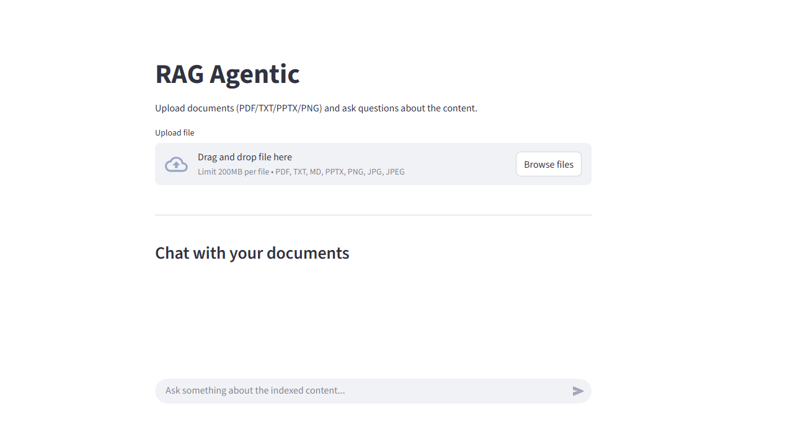
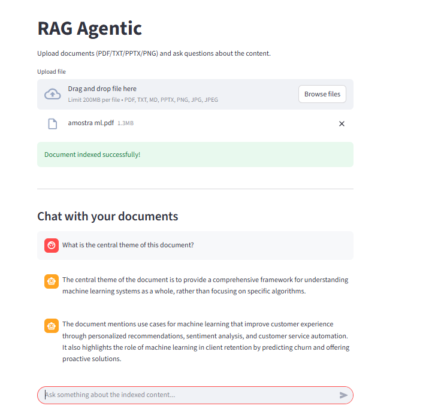

# RAG Agentic Project

## Table of Contents
- [Overview](#overview)
- [Project Structure](#project-structure)
- [Features](#features)
- [Architecture](#architecture)
- [Setup & Installation](#setup--installation)
- [Usage](#usage)
- [API Documentation](#api-documentation)
- [Streamlit Application](#streamlit-application)
- [Strategies](#strategies)
- [Results](#results)

## Overview
This project implements a Retrieval-Augmented Generation (RAG) system with agentic capabilities. It combines document retrieval with language models to provide intelligent, context-aware responses.

## Project Structure
```
rag-agentic/
├── apps/
│   ├── backend/
│   │   ├── src/
│   │   │   └── rag_backend/
│   │   │       ├── api/
│   │   │       ├── services/
│   │   │       └── main.py
│   │   ├── configs/
│   │   ├── Dockerfile
│   │   └── requirements.txt
│   │
│   ├── frontend/
│   │   ├── src/
│   │   │   └── rag_frontend/
│   │   │       └── app.py
│   │   ├── Dockerfile
│   │   └── requirements.txt
│   │
│   └── tests/
│
├── packages/
│   └── rag-core/
│       └── src/
│           └── rag_core/
│               ├── agents/
│               ├── ingestion/
│               ├── retrieval/
│               ├── llm/
│               └── vectorstore/
│
├── data/
│   └── raw/                
├── docker-compose.yml
├── .env.example
└── README.md
```

## Features
- **Document Retrieval**: Efficient semantic search using embeddings
- **Agentic Layer**: Orchestrates retrieval and LLM components to enable context-aware responses and multi-step reasoning
- **REST API**: FastAPI-based API for integration
- **Streamlit UI**: User-friendly interface for interaction
- **Multi-document Support**: Process multiple documents simultaneously

## Architecture

### RAG Architecture
This project follows a modular architecture:

- **rag_backend** → FastAPI service handling API requests
- **rag_frontend** → Streamlit interface
- **rag_core** → Core RAG logic (retrieval, LLM, agents)

This separation allows:

- reusability of core logic
- independent deployment
- cleaner scaling


### RAG Engine
The RAG engine handles document embedding and retrieval using vector similarity search.

### Agent Layer
The agent layer orchestrates the RAG engine with language models for intelligent task completion.

### API Server
FastAPI server exposing endpoints for RAG and agentic operations.

### Streamlit App
Interactive web interface for end-users.

## Quick Start (Recommended)

### Clone the repository
```bash
git clone <repository-url>
cd rag-agentic
```

### Environment Variables
```bash
cp .env.example .env
```

Then edit .env:
```bash
OPENAI_API_KEY=your_key_here

API_URL=http://backend:8000
```
## Usage

### Run with Docker
```bash
docker-compose up --build
```
### Access the application
**Frontend (Streamlit):**
http://localhost:8501
**Backend (FastAPI Docs):**
http://localhost:8000/docs

**API Screenshot**


**Streamlit Interface**


## API Documentation

### Endpoints

#### POST /upload
Upload documents for indexing.
Request:

multipart/form-data (file)

#### POST /chat
Conversational query with memory.
```json
{
   "question": "What is this document about?",
  "history": []
}
```

#### POST /ask
Simple query without conversation history.
```json
{
  "question": "Explain machine learning"
}
```

#### GET /health
Check if the API is running.

## Streamlit Application

Features include:
- Document ingestion (PDF, TXT, PPTX, images)
- Semantic search with embeddings
- Hybrid retrieval (vector + lexical)
- Conversational RAG with memory
- Agentic orchestration layer
- Streamlit-based UI

## Strategies

### Retrieval Strategy
- **Embedding Model**: Semantic embeddings for document encoding
- **Similarity Metric**: Cosine similarity for relevance ranking
- **Top-K Retrieval**: Configurable context window

### Agent Strategy
- **Chain-of-Thought**: Step-by-step reasoning
- **Tool Integration**: Access to retrieval and external APIs
- **Dynamic Decision Making**: Context-aware response generation

### Optimization
- Vector caching for performance
- Batch processing for multiple queries
- Rate limiting and request throttling

## Results

### Performance Metrics
[Insert performance data and screenshots]

### Example Responses


## Libraries Used

### Processing and Embeddings
- **LangChain**: Framework for building LLM applications
- **OpenAI**: API for language models (GPT-4 mini)
- **sentence-transformers**: Semantic embedding generation
- **FAISS**: Vector similarity search library

### API and Web
- **FastAPI**: Framework for building REST APIs
- **Streamlit**: Framework for interactive web applications
- **Uvicorn**: ASGI server for FastAPI

### Data Processing
- **numpy**: Numerical operations
- **pandas**: Data manipulation
- **python-dotenv**: Environment variable management

## Chunking Strategies

### Implemented Approaches
- **Fixed-size Chunks**: Document division into fixed-size chunks with overlap
- **Semantic Chunking**: Segmentation based on semantic boundaries between sections
- **Recursive Chunking**: Hierarchical document segmentation for improved context preservation
- **Overlap Strategy**: Context preservation through overlapping consecutive chunks


## Hybrid Search Strategies

### Vector Search
- **Vector Search**: Similarity search using text-embedding-3-small embeddings (cosine similarity)
- **FAISS Indexing**: Fast vector storage and retrieval

### Lexical Search
- **BM25**: Term frequency-based ranking algorithm
- **Full-text Search**: Keyword search in original documents

### Hybrid Ranking
- **Score Fusion**: Weighted combination of vector and lexical scores
- **Re-ranking**: Result refinement through multiple relevance strategies


## License
MIT License
```

